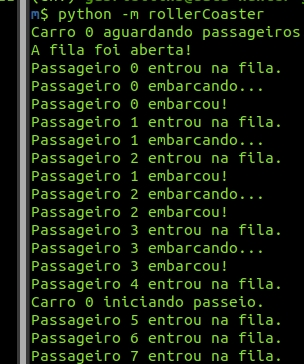

<!-- For rendering markdown LaTeX into pdf -->
<!-- <script type="text/javascript" src="http://cdn.mathjax.org/mathjax/latest/MathJax.js?config=TeX-AMS-MML_HTMLorMML"></script>
<script type="text/x-mathjax-config">
		MathJax.Hub.Config({ tex2jax: {inlineMath: [['$', '$']]}, messageStyle: "none" });
</script> -->

<center>
	
  <h2> Universidade Estadual do Ceará &ndash; UECE </h2>
</center>

---

**Curso:** Ciência da Computação<br>
**Disciplina:** Programação Paralela e Concorrente<br>
**Docente:** Marcial Porto Fernandez<br>
**Discente:** Gabriel Furtado Lins Melo<br>
**Matrícula:** 1394225

---

<h1> The Roller Coaster Problem </h1>

<h3> Sumário </h3>

- [Descrição](#descrição)
- [Instalação (Linux)](#instalação-linux)
- [Execução](#execução)
- [Relatório](#relatório)
  - [Formulação do problema](#formulação-do-problema)
    - [Caso carro único](#caso-carro-único)
    - [Caso 2 carros](#caso-2-carros)
    - [Caso 3 carros](#caso-3-carros)
  - [Descrição dos algoritmos](#descrição-dos-algoritmos)
  - [Descrição da implementação](#descrição-da-implementação)
    - [Classe Montanha Russa](#classe-montanha-russa)
    - [Classe Passageiro](#classe-passageiro)
    - [Classe Carro](#classe-carro)
  - [Resultados](#resultados)
    - [Caso carro único](#caso-carro-único-1)
    - [Caso 2 carros](#caso-2-carros-1)
    - [Caso 3 carros](#caso-3-carros-1)
- [Referências](#referências)

<hr>

### Descrição

Trabalho acadêmico da disciplina de Programação Concorrente e Paralela. Consiste na implementação, em _Python_, da resolução do problema de concorrência _Roller Coaster_.

<hr>

### Instalação (Linux)

**1.** Instale o Python 3.9, o gerenciador de pacotes Python (pip) e o gerenciador de ambientes virtuais Python:

```
sudo apt install python3.9
sudo apt install python3-pip
sudo pip install --upgrade pip
sudo pip install virtualenv
```

**2.** Clone este repositório com:

```
git clone git@github.com:GabrielLins64/Roller-Coaster-Problem.git
```

**3.** Navegue ao diretório raiz do projeto e crie um ambiente virtual _Python_ para instalar as dependências do projeto:

```
$ cd Roller-Coaster-Problem
$ python3.9 -m venv env
```

**4.** Ative o ambiente virtual:

```
$ source env/bin/activate
```

**5.** Atualize a versão do pip no ambiente virtual (necessário para algumas dependências):

```
$ pip install --upgrade pip
```

**6.** Instale as dependências do projeto com:

```
$ pip install -r requirements.txt
```

\*Quando quiser desativar o ambiente virtual use:

```
$ deactivate
```

<hr>

### Execução

Para configurar os parâmetros dos experimentos, altere as variáveis em `rollerCoaster/configs.json`.

Antes de executar o código, ative o ambiente virtual e, se necessário, instale as dependências, conforme o indicado na seção de [instalação](#instalação-linux). Então, no diretório raiz do projeto, execute com:

```
(env) $ python -m rollerCoaster
```

<hr>

### Relatório

#### Formulação do problema

Conforme Fernández (2021), o Problema da Montanha Russa (Roller Coaster) é um exemplo lúdico de um problema muito comum em controle de processos. O problema simula uma montanha russa onde pessoas entram na fila esperando a vez, depois entram no carro, que quando estiver cheio, parte para a viagem até retornar para pegar novos passageiros.

Para resolvê-lo deve-se usar princípios básico de programação concorrente.

O problema da Montanha Russa usa apenas três processos: a montanha russa, o processo main(), os passageiros e o(s) carro(s). Para facilitar o entendimento, sugiro usar para nomes das classes: MontanhaRussa(), Passageiro() e Carro().

O sistema não possui um "controlador" (ou a pessoa que controla a movimentação da montanha russa), isto é, a função MontanhaRussa() apenas cria os carros e os passageiros. Depois disso, os Passageiro() e Carro() se autocontrolarão sozinhos, isto é, os passageiros saberão a hora de esperar na fila, entrar no carro, sair do carro e o carro saberá quando sair, conforme as condições foram atendidas.

Desenvolver um algoritmo concorrente e códigos para a montanha russa, o carro e os passageiros. Desenvolver uma solução para sincronizá-los usando exclusão mútua com espera bloqueada. Pense em escrever o código genérico, prevendo os demais casos....

Atenção: os tempos indicados não são realistas mas coerentes, para que o tempo de execução do programa seja tolerável (2-3 min).

##### Caso carro único

O primeiro caso é apenas para aquecimento...

Considere a montanha russa com apenas 1 (um) carro com C lugares. Considere n passageiros, que chegam repetidamente e esperam em uma fila na plataforma para entrar no carro, que pode acomodar C passageiros, sendo C < n.

O tempo de chegada dos n passageiros à montanha russa é Tp, que é aleatório. Atenção: os passageiros deverão ser criados pela função MonhanhaRussa() continuamente atendendo o tempo estabelecido. No entanto, o carro só pode partir e começar o passeio pelo trilho quando estiver cheio (existir o número de pessoas na fila suficiente para enche-lo). Considere um tempo Te como o tempo em que todos os passageiros embarquem e desembarquem do carro. O carro então inicia o passeio que leva um tempo Tm e quando chegar na plataforma, os passageiros saem e entram os novos passageiros.

Considere n = 52, C = 4, Te = 1 seg, Tm = 10 seg, Tp = 1 a 3 seg.

##### Caso 2 carros

Considere agora que existem m carros na montanha russa, sendo m> 1. Uma vez que existe apenas um trilho, os carros não podem passar sobre os outros, isto é, eles devem percorrer o trilho na ordem em que começou. Mais uma vez, um carro só pode sair quando estiver cheio.

Considere n = 92 , m = 2, C = 4, Te = 1 seg, Tm = 10 seg, Tp = 1 a 3 seg.

##### Caso 3 carros

Esse é o ultimo caso, três carros simultâneos.

Considere n = 148, m = 3, C = 4, Te = 1 seg, Tm = 10 seg, Tp = 1 a 3 seg.

#### Descrição dos algoritmos

O início do algoritmo consiste na Classe Montanha Russa gerando a quantidade definida de Carros e Passageiros como Threads, cada. A partir daí, ambas as classes (Carros e Passageiros) passam a se autogerenciar, respeitando a ordem de saída dos carros e a ordem da fila, bem como sabendo em que momento um Passageiro deverá embarcar ou desembarcar de um Carro.

A abordagem utilizada para o devido funcionamento do modelo foi a de manter duas esperas ocupadas em cada Passageiro, uma para verificar sua posição na fila e só entrar no Carro quando possível, e uma para verificar se o mesmo está parado e vazio. Já para a classe Carro, existe apenas uma espera ocupada, na qual este constantemente verifica se já possui a capacidade máxima de passageiros e, quando possuir, inicia o passeio e sinaliza, utilizando flags globais - _mutexes_ (memória compartilhada), representando qual o carro que os próximos passageiros deverão entrar, evitando, assim, condições de corrida e a quebra de ordem.

Como a linguagem _Python_ não permite que se "mate" Threads, foi necessária a utilização de um gerenciador (que não foi instanciado como Thread) para constantemente verificar o término do programa e, quando atingido, limpar a memória e gerar os relatórios da execução.

Visualizando em pseudo-código, podemos ter a seguinte representação deste modelo:

```
função montanha_russa (parâmetros) {
  para (carro em carros) {
    Thread carro;
    carro.iniciar();
  }

  para (passageiros em passageiros) {
    Thread passageiro;
    esperar(passageiro.tempo_de_chegada);
    global fila.adicionar(passageiro);
    passageiro.iniciar();
  }

  enquanto(nao_terminou_execucao) {
    esperar();
  }

  gerar_relatorio();
}
```

#### Descrição da implementação

O código consiste em 3 classes principais: [MontanhaRussa](#classe-montanha-russa), [Passageiro](#classe-passageiro) e [Carro](#classe-carro). Para a devida comunicação entre as Threads, são utilizadas variáveis de acesso global, isto é, recursos compartilhados para funcionar como _mutexes_ e controle de ordem. Como mecanismo de exclusão mútua em cada Thread, além dos _mutexes_, é utilizada a espera bloqueada. Os detalhes de implementação de cada fluxo de funcionamento são descritos abaixo para cada classe.

##### Classe Montanha Russa

A classe de Montanha Russa tem a função exclusivamente de, dados os parâmetros de entrada, inicializar todos os carros e passageiros em suas devidas Threads. A partir de então, estes se autogerenciam. Recebe, como parâmetros de instanciamento, as variáveis de configuração do problema (n, m, C, Te, Tm e Tp).

A classe consiste nos métodos:

- criar_passageiros() : Cria os passageiros em seus devidos tempos
- ligar_carros() : Cria e inicializa as instâncias de carros
- verificar_termino() : Espera ocupada para finalizar o programa
- comecar() : Inicializa variáveis e chama os métodos de criação de carros e passageiros

##### Classe Passageiro

A classe Passageiro é responsável por colocar sua instância na fila global, no tempo de chegada deste passageiro (escolhido aleatoriamente dentre os possíveis valores de Tp), bem como por gerenciar seu embarque, consequentemente removendo-o da fila, e desembarque. Cada passageiro é identificado por um número de _ticket_ único, gerado em sua inicialização pela Montanha Russa.

Seus métodos são:

- chegar() : Coloca o passageiro na fila
- embarcar() : Embarca o passageiro em um carro
- desembarcar() : Desembarca o passageiro de um carro

##### Classe Carro

A classe Carro é responsável por verificar constantemente (espera ocupada) se a quantidade de passageiros embarcados é igual à sua capacidade. Então, realiza seu passeio dormindo por Tm segundos, de maneira concorrente, sinalizando para que o próximo carro, quando houver, comece a aguardar mais passageiros. Ao término do passeio, a instância faz com que cada passageiro em sua lista de passageiros embarcados seja desembarcado, e então é liberado para mais passageiros entrarem caso não haja outro carro vazio à frente.

Os métodos desta classe são:

- aguardar_passageiros() : Espera ocupada até embarcar todos os C passageiros
- iniciar_passeio() : Inicia o passeio da instância de Thread do Carro
- parar() : Para o carro para os passageiros desembarcarem
- iniciar() : Inicia o laço pseudo-infinito de funcionamento do carro - aguardar, passeio, parar

<hr>

#### Resultados

A execução da instância do problema ocorreu sem problemas (_deadlocks_ ou _starvations_) para qualquer um dos casos. Os resultados foram interessantes, mostrando que o aumento de número de carros (m) diminui impactantemente o tempo de aguardo de passageiros na fila.

##### Caso carro único

```
Relatório do experimento 4
Data de execução: Wed Jul 14 16:46:52 2021
Duração do experimento: 261.34 s
Parâmetros:
	n: 52
	m: 1
	C: 4
	Te: 1
	Tm: 10
	Tp: [1, 3]

~~~~~~~~~ X ~~~~~~~~~ X ~~~~~~~~~

Carro 0:
	Tempo parado: 131.344
	Tempo em movimento: 130
	Tempo total: 261.344
	Percentual de utilização: 0.497

Passageiros:
Tempo mínimo de espera na fila: 0.506
Tempo máximo de espera na fila: 142.862
Tempo médio de espera na fila: 71.292
```

<div style="display: flex;">
  <div style="flex: 50%; padding: 5px;">
    
  </div>
  <div style="flex: 50%; padding: 5px;">
    
  </div>
</div>

##### Caso 2 carros

```
Relatório do experimento 5
Data de execução: Wed Jul 14 16:52:08 2021
Duração do experimento: 242.33 s
Parâmetros:
	n: 92
	m: 2
	C: 4
	Te: 1
	Tm: 10
	Tp: [1, 3]

~~~~~~~~~ X ~~~~~~~~~ X ~~~~~~~~~

Carro 0:
	Tempo parado: 122.328
	Tempo em movimento: 120
	Tempo total: 242.328
	Percentual de utilização: 0.495

Carro 1:
	Tempo parado: 132.32
	Tempo em movimento: 110
	Tempo total: 242.32
	Percentual de utilização: 0.454

Passageiros:
Tempo mínimo de espera na fila: 0.505
Tempo máximo de espera na fila: 39.712
Tempo médio de espera na fila: 18.375
```

<div style="display: flex;">
  <div style="flex: 50%; padding: 5px;">
    
  </div>
  <div style="flex: 50%; padding: 5px;">
    
  </div>
</div>

##### Caso 3 carros

```
Relatório do experimento 6
Data de execução: Wed Jul 14 16:56:48 2021
Duração do experimento: 309.34 s
Parâmetros:
	n: 148
	m: 3
	C: 4
	Te: 1
	Tm: 10
	Tp: [1, 3]

~~~~~~~~~ X ~~~~~~~~~ X ~~~~~~~~~

Carro 0:
	Tempo parado: 179.342
	Tempo em movimento: 130
	Tempo total: 309.342
	Percentual de utilização: 0.42

Carro 1:
	Tempo parado: 189.334
	Tempo em movimento: 120
	Tempo total: 309.334
	Percentual de utilização: 0.388

Carro 2:
	Tempo parado: 189.323
	Tempo em movimento: 120
	Tempo total: 309.323
	Percentual de utilização: 0.388

Passageiros:
Tempo mínimo de espera na fila: 0.504
Tempo máximo de espera na fila: 1.834
Tempo médio de espera na fila: 0.634
```

<div style="display: flex;">
  <div style="flex: 50%; padding: 5px;">
    
  </div>
  <div style="flex: 50%; padding: 5px;">
    
  </div>
</div>

<hr>

### Referências

[1] **Elliot Forbes**. _Learning Concurrency in Python_. Packt Publishing: 2017.

[2] FERNÁNDEZ, Marcial. Problema da Montanha Russa. **Marcial Fernández**, 2021. Disponível em: <http://marcial.larces.uece.br/cursos/programacao-concorrente-e-paralela-2020-2/problema-da-montanha-russa>. Acesso em 12 de julho de 2021.
